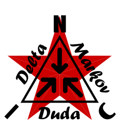

<p align="center">
  
</p>

★ N.I.C. ★

# NIC DMD — Delta Markov Duda

*[English](README.md) · [Čeština](README_cs.md) · [Русский](README_ru.md)*

*Основной является английская версия.*

## Протокол сжатия для встраиваемых устройств

[](https://opensource.org/licenses/MIT)

---

## Что такое DMD?

DMD — это мультиплатформенный протокол сжатия небольших пакетов данных от метеостанций, счётчиков электроэнергии, GPS-трекеров и других встраиваемых устройств. Он предназначен для передачи по технологиям с ограниченной пропускной способностью, таким как LoRa.

Протокол полностью работоспособен на контроллере ATmega328 и не требует больших словарей или таблиц поиска в памяти. Каждый пакет сжимается без общего словаря и без передаваемой таблицы — с адаптивным выбором лучшего метода из пяти кандидатов. **Исключение составляет дельта-этап, и это важно для транспорта:** пакет дельта-кодируется относительно *предыдущего* пакета, а кодер ресинхронизируется ключевым кадром каждый 7-й пакет (`DMD_KEYFRAME_EVERY`). Поэтому потеря одного пакета обходится потерей ещё до шести. На надёжном канале это ничего не стоит; канал с потерями должен либо принудительно отправлять ключевые кадры, либо передавать вместо этого кадр без состояния.

---

## Почему DMD?

Существующие библиотеки сжатия для встраиваемых устройств либо требуют сотен дополнительных байт RAM (Heatshrink), либо вынуждены передавать таблицу Хаффмана вместе с данными. DMD использует другой подход — он сочетает несколько простых методов с эвристическим анализом и выбирает лучший результат для каждого пакета индивидуально.

**Основные преимущества:**
- Фиксированная таблица Хаффмана только в ROM (64B), без дополнительной RAM
- Адаптивный выбор метода для каждого пакета — до 5 кандидатов
- Полностью детерминированная распаковка — без потери данных
- Максимальное расширение данных в худшем случае — 1 байт (заголовок)
- Реализации как на Python, так и на C (ATmega328 / Arduino)

---

## Когда DMD не имеет смысла

DMD предназначен для данных, которые меняются со временем медленно и предсказуемо, — значений датчиков, GPS-координат, промышленной телеметрии. Если входные данные случайны, зашифрованы или уже сжаты, DMD добавляет только 1 байт заголовка и отправляет их как RAW. Это правильное поведение — никакого сжатия с потерями, никакой деградации.

---

## Совместимость

**Python:** 3.10 или новее (используются аннотации типов `bytes | None`).

**C:** C99 или новее. Протестировано с GCC на ПК (Linux/Windows) и AVR-GCC для ATmega328. Нет зависимостей от стандартной библиотеки, кроме `<string.h>`. Внутренние буферы задаются через C99 VLA в соответствии с фактической длиной пакета.

**Arduino:** Скопируйте `c/nic_dmd.c` и `c/nic_dmd.h` в папку своего проекта. Совместимо с Arduino IDE 1.8+ и 2.x (AVR-GCC поддерживает C99 VLA).

**Примечание для других компиляторов:** IAR, Keil и MSVC C++ не поддерживают VLA. Для этих тулчейнов можно при компиляции определить `-DDMD_PKT_MAX_BUILD=N` (например, 32 или 64), и буферы будут фиксированного размера.

**Зависимости для fetch/benchmark:** `pip install requests`

**Длина пакета:** Минимальный технический предел — 1B, но ниже 16B сжатие практически бесполезно — накладные расходы заголовка (1B) и состояние ANS (2B) съедают большую часть потенциальной экономии. Рекомендуемый минимум — **16B**. Максимум — **255B**. Для передачи по LoRa практический предел полезной нагрузки составляет 51–64B в зависимости от коэффициента расширения спектра (spreading factor) и региона. Лучших результатов DMD достигает на данных, в которых соседние пакеты меняются медленно, — как правило, это телеметрия датчиков размером 16–64B.

---

## Проверка и целостность данных

Ради максимальной производительности и абсолютной минимизации нагрузки на процессор библиотека не выполняет никаких дополнительных проверок заголовка и проверки длины входных данных.

Конструкция протокола строго предполагает, что проверки целостности (например, аппаратный CRC) и отбрасывание повреждённых или пустых пакетов выполняются нижним транспортным уровнем или основной программой (как правило, самим радиомодулем, логикой сбора данных и т. п.). Пользователи библиотеки должны на уровне приложения гарантировать, что функциям сжатия и распаковки передаются только структурно корректные данные. Благодаря делегированию этой ответственности удалось добиться низких накладных расходов по памяти без траты тактов процессора.

---

## Результаты

Протестировано более чем на 50 000 отсчётах из 20 реальных и синтетических источников данных (метеостанции, GPS, счётчики электроэнергии, промышленные датчики, сейсмология, качество воздуха). Ошибки при проверке туда-обратно (round-trip): **0 во всех наборах данных**.

Столбец **output B/pkt** — это средний фактический размер передаваемого пакета после сжатия (включая 1B заголовка). Это решающий показатель для расчёта окна передачи LoRa.

### Таблица 1 — однородный int16 (fetch_plus.py)

Все поля хранятся как `int16` с масштабированием ×100, пакеты дополнены нулями до фиксированной длины. Наборы данных прогнозов содержат 384 отсчёта (16 дней × 24 часа), остальные — 8 000–10 000 отсчётов.

```
===================================================================================
  Dataset                    | Pkts  | Input | Output  | Saving | Dominant method
------------------------------|-------|-------|---------|--------|------------------
NOAA San Francisco (tides)    |  8184 |  16 B |   6.4 B |  62.2% | DELTA1+ZZ+FLAG
NOAA New York (tides)         |  8184 |  16 B |   6.7 B |  60.6% | DELTA1+ZZ+FLAG
DWD Fichtelberg (meteo)       | 10000 |  16 B |   8.1 B |  52.6% | DELTA1+ZZ+FLAG 75%
DWD Helgoland (meteo)         | 10000 |  16 B |   8.5 B |  49.8% | DELTA1+ZZ+FLAG 74%
DWD Zugspitze (meteo)         | 10000 |  16 B |   8.6 B |  49.2% | DELTA1+ZZ+FLAG 73%
GPS Trek                      | 10000 |  16 B |   8.6 B |  49.3% | DELTA1+ZZ+FLAG 53%
Complex station               | 10000 |  64 B |  38.6 B |  40.7% | DELTA1+ZZ+HUF  84%
AirQuality Brno               |   168 |  16 B |  10.3 B |  39.7% | FLAG + D1+ZZ+FLAG
AirQuality Ostrava            |   168 |  16 B |  10.5 B |  38.4% | FLAG + D1+ZZ+FLAG
Electricity meters            | 10000 |  16 B |  10.6 B |  37.7% | DELTA1+ZZ+HUF  52%
AirQuality Prague             |   168 |  16 B |  10.6 B |  37.6% | FLAG + D1+ZZ+FLAG
Forecast Prague (32B)         |   384 |  32 B |  22.0 B |  33.2% | DELTA1+ZZ+FLAG 58%
Forecast Brno (32B)           |   384 |  32 B |  22.4 B |  32.1% | DELTA1+ZZ+FLAG 55%
IoT building                  | 10000 |  16 B |  11.7 B |  31.3% | DELTA1+ZZ+HUF  84%
Industrial sensor             | 10000 | 128 B |  89.3 B |  30.7% | DELTA1+ZZ+HUF  80%
Forecast Ostrava (16B)        |   384 |  16 B |  12.3 B |  27.3% | DELTA1+ZZ+FLAG 42%
Forecast Prague (16B)         |   384 |  16 B |  12.4 B |  26.8% | DELTA1+ZZ+FLAG 41%
Forecast Brno (16B)           |   384 |  16 B |  12.5 B |  26.5% | DELTA1+ZZ+FLAG 43%
Forecast Bratislava (16B)     |   384 |  16 B |  12.7 B |  25.3% | DELTA1+ZZ+FLAG 38%
USGS seismology               | 10000 |  16 B |  13.9 B |  18.2% | FLAG 29% (chaotic)
===================================================================================
  Range: 18 % – 62 %   |   Errors: 0
===================================================================================
```

### Таблица 2 — плотная упаковка с учётом схемы (fetch_small.py)

Каждое поле хранится в наименьшем необходимом типе (uint8/int16) с масштабированием ×10, без дополнения нулями.

```
===================================================================================
  Dataset                    | Pkts  | Input | Output  | Saving | Dominant method
------------------------------|-------|-------|---------|--------|------------------
Forecast Prague (27B)         |   384 |  27 B |  17.1 B |  39.0% | DELTA1+ZZ+HUF  63%
Forecast Brno (27B)           |   384 |  27 B |  17.2 B |  38.5% | DELTA1+ZZ+HUF  61%
AirQuality Brno (12B)         |   168 |  12 B |   8.3 B |  35.9% | DELTA1+ZZ+HUF  49%
AirQuality Ostrava (12B)      |   168 |  12 B |   8.5 B |  34.8% | DELTA1+ZZ+HUF  47%
AirQuality Prague (12B)       |   168 |  12 B |   8.6 B |  34.2% | DELTA1+ZZ+HUF  44%
Forecast Ostrava (13B)        |   384 |  13 B |   9.3 B |  33.6% | DELTA1+ZZ+HUF  67%
Forecast Brno (13B)           |   384 |  13 B |   9.3 B |  33.3% | DELTA1+ZZ+HUF  69%
Forecast Prague (13B)         |   384 |  13 B |   9.3 B |  33.3% | DELTA1+ZZ+HUF  70%
Forecast Bratislava (13B)     |   384 |  13 B |   9.4 B |  32.5% | DELTA1+ZZ+HUF  72%
DWD Fichtelberg (9B)          | 10000 |   9 B |   6.3 B |  37.0% | D1+ZZ+ANS  49%
DWD Helgoland (9B)            | 10000 |   9 B |   6.4 B |  36.0% | D1+ZZ+ANS  42%
DWD Zugspitze (9B)            | 10000 |   9 B |   6.4 B |  35.6% | D1+ZZ+ANS  42%
USGS seismology (8B)          | 10000 |   8 B |   8.6 B |   3.9% | RAW 79% ⚠ expansion
NOAA New York (3B)            |  8184 |   3 B |   4.0 B |   0.0% | RAW 100% ⚠ expansion
NOAA San Francisco (3B)       |  8184 |   3 B |   4.0 B |   0.0% | RAW 100% ⚠ expansion
===================================================================================
  Range: 0 % – 39 %   |   Errors: 0
  ⚠ For packets < 8B, output is larger than input — header overhead (1B) outweighs savings.
===================================================================================
```

### Таблица 3 — сырой текст JSON/CSV (fetch_raw_text.py)

Данные в точности в том виде, в каком они получены из источников, — без двоичной упаковки, текст как байты, дополненный нулями до длины первой записи.

```
===================================================================================
  Dataset                    | Pkts  | Input  | Output  | Saving | Dom. method
------------------------------|-------|--------|---------|--------|---------------
DWD Helgoland (raw CSV)       | 10000 |  72 B  |  21.2 B |  71.0% | D1+ZZ+ANS 69%
DWD Zugspitze (raw CSV)       | 10000 |  72 B  |  21.3 B |  70.9% | D1+ZZ+ANS 68%
DWD Fichtelberg (raw CSV)     | 10000 |  72 B  |  21.4 B |  70.7% | D1+ZZ+ANS 67%
NOAA San Francisco (raw JSON) |  8448 |  72 B  |  26.7 B |  63.4% | D1+ZZ+FLAG 38%
NOAA New York (raw JSON)      |  8448 |  72 B  |  27.3 B |  62.6% | D1+ZZ+FLAG 37%
Forecast Bratislava (raw JSON)|   384 | 200 B  |  73.2 B |  63.6% | D1+ZZ+ANS  40%
===================================================================================
  Range: 63 % – 71 %   |   Errors: 0
===================================================================================
```

---

## Методы сжатия

**1. Дельта-кодирование + ZigZag (DELTA1)**

Кодер вычитает из каждого значения предыдущее (формируя разности). Декодер прибавляет их обратно — полностью обратимо, без потерь. ZigZag преобразует целые числа со знаком (как положительные, так и отрицательные) в небольшие беззнаковые целые для лучшей энтропии. Этот метод доминирует примерно в 70% тестовых случаев, потому что естественные данные датчиков меняются медленно.

**2. FLAG — устранение нулей**

Заменяет каждую последовательность нулевых байтов битом в битовой карте. Полезная нагрузка: `[1B length][bitmap][non-zero bytes]`. Тривиально декодируется — без плавающей точки, без состояния. Включается, когда нулей среди байтов >= 30%. Очень эффективен на разреженных данных (много нулей вперемешку с реальными значениями).

**3. ANS — Asymmetric Numeral Systems (асимметричные системы счисления)**

Арифметическое кодирование байтов кодами переменной длины. Кодер на лету строит таблицу частот и кодирует байты как поток. Декодер использует обратный конечный автомат — словарь не нужен. Быстр на небольших пакетах, особенно на текстовых и CSV-данных.

Полезная нагрузка ANS содержит длину данных (1B), состояние (2B — uint16_t) и закодированные байты. Вступает в действие, только если доля нулевых байтов >= 45% (эвристика). И у кодера, и у декодера есть ранний выход — если результат превышает предел, вычисление немедленно прекращается.

**4. Полубайтовый Хаффман (HUF)**

Фиксированная таблица Хаффмана, обученная на объединённых метеорологических и GPS-данных после delta+ZigZag. Кодирует каждый байт двумя кодами полубайтов (hi и lo). Таблица хранится в ROM (64 B PROGMEM на ATmega), без дополнительной RAM.

Максимальная длина кода — 6 бит, в среднем ~3.2 бита на байт. Выигрывает особенно на IoT-, промышленных и комплексных данных, где нули редки, но распределение полубайтов соответствует таблице.

**5. Комбинация FLAG+HUF**

Сначала FLAG выносит нулевые байты в битовую карту, затем Хаффман сжимает оставшиеся ненулевые байты. Полезная нагрузка: `[1B length][bitmap][1B valid bits HUF][HUF stream]`. Лучшее из обоих миров — детерминированное устранение нулей + энтропийное сжатие остального.

**Ключевой кадр и начальный кадр**

Отсчёт с номером 0 является ключевым кадром. Поскольку нет предыдущего пакета для вычисления дельты, разностный метод и ZigZag пропускаются. Данные обрабатываются непосредственно методами FLAG, HUF, FLAG+HUF или ANS. Ключевой кадр возникает автоматически каждые 7 пакетов или после сброса устройства.

---

## Дорожная карта — доменные таблицы (многотабличный Хаффман)

*Пока не реализовано — здесь записана концепция, чтобы она не потерялась.*

Сегодня метод Хаффмана (метод 4) использует **одну фиксированную таблицу**, обученную на объединённых метеорологических + GPS-данных
и зашитую в ROM. Эта единственная таблица — компромисс: «универсальная» таблица никогда не может быть отличной для
всего — она должна покрывать каждый случай, поэтому хорошо работает на данных, похожих на те, на которых её обучали, и хуже
на остальных (счётчики электроэнергии, сейсмология, …).

**Идея:** иметь небольшую **библиотеку таблиц**, каждая из которых обучена на одном виде данных (погода, GPS,
электроэнергия, сейсмика, радиация, …). Компрессор использует таблицу, соответствующую данным, — таблица,
обученная на *ваших* данных, превосходит универсальную. (Та же идея, что и обученные словари в Zstandard.)

**Как это вписывается — не трогая 1-байтовый заголовок:**
Заголовок уже заполнен и **должен оставаться 1 байтом** — более крупный заголовок съел бы экономию на маленьких
пакетах, а в этом весь смысл DMD. Поэтому таблица **не** передаётся в каждом пакете. Это **параметр сеанса /
инициализации, точно так же, как длина пакета**, — которая тоже не содержится в пакете и должна совпадать на
обоих концах. Обе стороны вызывают `dmd_init(len, table_id)`; **ноль дополнительных байтов в линии.**
- **Один канал LoRa:** оба конца настроены на одну и ту же таблицу для этого канала. Чтобы переключиться, выполните повторную инициализацию
  с другой таблицей между потоками.
- **Хранение в MLA:** идентификатор таблицы хранится **один раз в схеме, для каждого типа записи** (glue уже
  описывает каждую запись) — декодер читает его из схемы, а не из каждого пакета. Таким образом, смешанный MLA
  всё равно получает правильную таблицу для каждого типа данных, а пакеты DMD остаются нетронутыми.
- **Идентификатор таблицы 0 = текущая универсальная таблица** → старые данные и старое поведение не меняются (обратная
  совместимость).

**Почему сейчас, а не на ATmega328:** оригинал хранил одну таблицу размером 64 B, потому что у ATmega было всего
32 KB флеш-памяти. На сегодняшних микросхемах (например, 512 KB) несколько таблиц легко помещаются. **Код и скорость остаются
прежними** — компрессор просто указывает на другую таблицу; растёт только занимаемая флеш-память, а **формат передачи
не меняется** (таблица — параметр инициализации, а не поле заголовка). Оба конца должны использовать одну и ту же библиотеку
таблиц с доступом по ID.

---

## Использование

### Python

```python
from nic_dmd import DmdEncoder, DmdDecoder

PKT_LEN = 16
enc = DmdEncoder(PKT_LEN)
dec = DmdDecoder(PKT_LEN)

data = bytes([0xFC, 0x18, 0x21, 0x34, 0x01, 0x81,
              0x04, 0xCE, 0x00, 0x00, 0xFC, 0x7C,
              0xFC, 0xA8, 0x00, 0x00])

compressed   = enc.compress(data)
decompressed = dec.decompress(compressed)

print(f"Compressed: {PKT_LEN}B → {len(compressed)}B")
assert decompressed == data
```

### C (ATmega328 / Arduino)

```c
#include "nic_dmd.h"

dmd_encoder_t enc;
dmd_decoder_t dec;

void setup() {
    dmd_encoder_init(&enc, 16);   // packet length — must match on both sides
    dmd_decoder_init(&dec, 16);
}

void loop() {
    uint8_t data[16]          = { /* sensor data */ };
    uint8_t compressed[DMD_OUT_MAX];   // DMD_OUT_MAX = packet length + 1 (up to 256B)
    uint8_t decompressed[16];

    uint16_t comp_len = dmd_compress(&enc, data, compressed);
    lora.send(compressed, comp_len);

    // On the receiver:
    int res = dmd_decompress(&dec, compressed, comp_len, decompressed);
    if (res != 0) {
        // res < 0 → packet is corrupted, see return value table below
    }
}
```

### Возвращаемые значения и коды ошибок

Каждая функция по завершении возвращает число. Это число — единственный способ, которым библиотека сообщает вам, как всё прошло, — никаких выводов на экран, никакого логирования (ради экономии памяти и производительности). Вышестоящая программа (та, что использует библиотеку) должна прочитать это число и действовать соответственно.

**`dmd_compress(...)` — сжатие**

Возвращает **длину выходных данных в байтах** (тип `uint16_t`, т. е. 16-битное число):

| Возвращаемое значение | Значение | Что делать |
|---|---|---|
| от 2 до 256 | Количество байтов для отправки (1B заголовка + сжатые данные) | Отправить ровно столько байтов из `output` |

Сжатие **никогда не завершается неудачей** и не имеет кода ошибки — вы всегда получаете корректную длину. В худшем случае (пакет размером 255B, который невозможно сжать, например случайные или зашифрованные данные) результат составляет **256 B**, т. е. на 1 байт больше, чем входные данные. Это называется максимальным расширением на 1B (этот 1 байт — обязательный заголовок). Поэтому возвращаемый тип 16-битный — чтобы вместить число 256. Выходной буфер, следовательно, должен иметь размер `DMD_OUT_MAX` (= длина пакета + 1).

**`dmd_decompress(...)` — распаковка**

Возвращает **код состояния** (тип `int`). Распакованные данные находятся в `output` только тогда, когда код равен `0`:

| Возвращаемое значение | Значение | Что делать |
|---|---|---|
| `0` | OK — всё прошло успешно, `output` содержит исходные данные | Использовать `output` |
| `-1` | Повреждённые или недопустимые входные данные (пустой пакет или несоответствие длины полезной нагрузки) | Отбросить пакет, данные непригодны |
| `-3` | Зарезервированная версия протокола (в заголовке `sample_num = 7`) | Этот пакет не относится к данной версии библиотеки — отбросить его |

Отрицательное число всегда означает «что-то не так, не используйте данные». Сама библиотека не выполняет проверок целостности (CRC и т. п.) — она предполагает, что повреждённые пакеты отлавливаются нижним уровнем (радиомодулем). Коды `-1` и `-3` — лишь последняя защита от явно бессмысленных входных данных.

> **Версия на Python ведёт себя идентично.** `DmdEncoder.compress()` возвращает выходные данные той же длины (включая те самые 256 B в худшем случае), а `DmdDecoder.decompress()` при повреждённых или недопустимых входных данных выбрасывает **исключение** вместо отрицательного кода — это эквивалент ошибки C в Python (зарезервированная версия протокола, в частности, вызывает `ValueError`). Обрабатывайте это с помощью `try/except`. В остальном один и тот же вход даёт **побайтово идентичный выход** и в C, и в Python, поэтому можно сжимать на устройстве с C и распаковывать на сервере/Raspberry Pi в Python (и наоборот).

---

### Компиляция для других компиляторов (без VLA)

Если ваш компилятор не поддерживает C99 VLA (IAR, Keil, MSVC C++), задайте максимальную длину пакета при компиляции:

```
gcc -DDMD_PKT_MAX_BUILD=32 c/nic_dmd.c ...
```

Буферы будут скомпилированы с фиксированным размером 32B. Для проектов с одной фиксированной длиной пакета (типичный случай использования Arduino) этот вариант идеален.

---

## Файлы

Репозиторий организован в три каталога по назначению:

```
c/        C implementation (embedded, ATmega328 / AVR-GCC)
python/   Python reference implementation + its tests
bench/    Benchmarks, data fetching and analysis tooling
makefile  Builds the C library and runs both C and Python tests
```

| Файл                    | Описание                                            |
| ----------------------- | --------------------------------------------------- |
| `python/nic_dmd.py`     | Реализация на Python — эталонная, для тестирования  |
| `c/nic_dmd.c`           | Реализация на C для ATmega328                       |
| `c/nic_dmd.h`           | Заголовочный файл                                   |
| `bench/nic_dmd_utils.py`| Вспомогательные функции — анализ и вывод результатов |
| `makefile`              | Компиляция и тестирование                           |

### Тестирование и бенчмарки

| Файл                      | Описание                                                               |
| ------------------------- | ---------------------------------------------------------------------- |
| `python/nic_dmd_test.py`  | Тесты на Python — туда-обратно (round-trip), погода, ключевой кадр     |
| `c/nic_dmd_test.c`        | Тесты на C — туда-обратно (round-trip), все нули, погода               |
| `bench/fetch_plus.py`     | Бенчмарк — реальные + синтетические данные, однородный int16 (20 источников) |
| `bench/fetch_small.py`    | Бенчмарк — те же источники, плотная упаковка с учётом схемы            |
| `bench/fetch_raw_text.py` | Бенчмарк — сырой текст JSON/CSV как байты                              |
| `bench/benchmark.py`      | Сравнение DMD с Huffman и Heatshrink                                   |

---

## Лицензия

MIT License — Copyright (c) 2026 NIC — Native Intellect Community

---

## Благодарности

Брату — за советы во время создания этого проекта.
За техническую помощь в оптимизации кода — ИИ-ассистентам Claude (Anthropic) и Gemini (Google).
