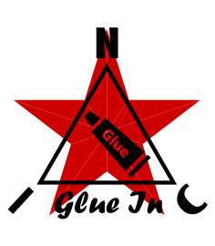

<p align="center">
  
</p>

# NIC-GLUE-IN

*[English](README.md) · [Čeština](README_cs.md) · [Русский](README_ru.md)*

*Závazná je anglická verze.*

**Propojovací vrstva mezi knihovnami NIC — DMD, KSF, MLA, VDE — na straně příjmu / zápisu.**

---

[](https://opensource.org/licenses/MIT)

---

```
   sensor row / wire packet ──▶ [ optional NIC-DMD ] ──▶ NIC-MLA container
                                                                 │
                                                                 ▼
                                            NIC-VDE  (read-only viewer / export)
```

> **Přečtěte si nejdřív.** Podobu glue *určujete vy.* Tyto knihovny lze propojit
> mnoha správnými způsoby a ten nejlepší závisí na vašem zařízení, vašem
> spoji a na tom, co chcete s daty dělat. Tento repozitář je proto **propracovaný
> příklad plus katalog možností** — ne framework, který musíte převzít. Trvalou
> hodnotou je zde **[referenční přehled sladění knihoven](#referenční-přehled-sladění-knihoven)**:
> malá sada styčných míst, na kterých se knihovny musejí shodnout, sepsaná jednou, aby
> se v nich každý vyznal. Směr čtení / exportu pokrývá
> sesterský projekt **NIC-GLUE-OUT**; **NIC-VDE** je prohlížeč.

---

## Referenční přehled sladění knihoven

Knihovny NIC jsou záměrně *hloupé a nezávislé*: MLA ukládá neprůhledné
bajty, DMD kóduje pakety pevné šířky, VDE zobrazuje soubory, KSF transformuje bajty.
Žádná z nich o ostatních neví. Vrstva glue je jakýkoli kód, který tato styčná místa
sladí. Je jich jen hrstka a správně je sladit je celá práce:

| Styčné místo | Co vystavuje každá strana | Jak se sladí |
|---|---|---|
| **Bit komprese + `kf_back`** | log MLA v1.2 nese 1bajtové `flags` (bit 7 = `compressed`, bity 0–6 = `kf_back`), ale nikdy je neinterpretuje; *který* kodek, to je ve vlastní hlavičce datového bloku (DMD bajt 0), nikdy v MLA | glue nastavuje bit `compressed` (`False` pro doslovně uložené řádky, `True` pro výstup DMD) a `kf_back`; druhy záznamů jsou **surový** (raw, nekomprimovaný), **klíčový snímek** (keyframe, komprimovaný, `kf_back == 0`), **delta** (komprimovaný, `kf_back > 0`) |
| **Klíčový snímek** | klíčový snímek DMD = číslo vzorku `0` (3bitové pole; hodnota `7` je vyhrazena pro verzi protokolu) | glue to zpětně přečte z blobu DMD (`blob[0] & 0x07 == 0` ⇒ klíčový snímek = vzorek DMD 0) a podle toho záznam označí |
| **Vzdálenost klíčového snímku** | log MLA má pole `kf_back`, které pouze přenáší; čtecí programy potřebují najít příslušný klíčový snímek | glue nastaví `kf_back` = počet záznamů zpět k příslušnému klíčovému snímku (`0` na klíčovém snímku) |
| **Nápověda kadence klíčových snímků** | prefix MLA má `keyframe_intv` (pouze metadata); kadence DMD je interní (`DMD_KEYFRAME_EVERY`) | výchozí hodnota základní knihovny `0`; glue předá kadenci do DMD, takže ji volající nikdy nezadává (lze přepsat) |
| **`subsec` (dva neprůhledné bajty)** | log MLA nese pole `subsec` — dva neprůhledné bajty, které patří glue (čas v rámci sekundy, sub-**sec**ond, *a/nebo* podsekce / rotace, sub-**sec**tion); MLA mu nepřisuzuje žádný význam | glue předává `subsec` beze změny v `log_raw` / `CompressedChannel.log` (16bitovou hodnotu nebo dva bajty sestavuje volající); ve stanici NIC volající zapisuje **index snímku** — viz [možnosti času](#1-odkud-se-bere-časová-značka) |
| **Šířka paketu** | DMD vyžaduje, aby každý paket v proudu měl *stejnou* šířku (delta) | šířka patří **kanálu** (4..255 B), vynucuje se při každém `log()`; různé kanály se mohou lišit |
| **Identita proudu** | identitou proudu v souboru *je* jeho index stanice v MLA; MLA nepotřebuje žádný další štítek u záznamu | čtecí program rozlišuje proudy podle stanice a čte `kf_back`, aby našel klíčový snímek každého proudu; jeden bezstavový kompresor DMD + N drobných kontextů pro jednotlivé proudy (`ChannelBank`) udržují delty v pořádku |
| **Rotace → klíčový snímek** | MLA v1.2 (2b) zpřístupňuje událost rotace + `will_rotate()`, aby každý rotovaný soubor šel dekódovat samostatně | `GlueArchiveLogger` + `ChannelBank` to propojují od začátku do konce: proud, který rotaci *vyvolá*, zkontroluje `will_rotate(pkt_len+1)` **před** kompresí a resetuje se, takže tento záznam je klíčový snímek (delta nikdy nepřekročí hranici souboru); každý *jiný* proud resetuje `on_rotate` → `reset_all()`. První záznam každého proudu v každém souboru je tedy klíčový snímek (u dat RAW bezpředmětné) |
| **Stanice** | log MLA ukládá 1bajtový *index* stanice (1..255), skutečná čísla jsou v tabulce stanic v prefixu | mapování index ↔ region/číslo spravuje glue/`MlaStationTable` |
| **Čas** | log MLA má vyhrazenou 4bajtovou `timestamp`; pole schématu `log("datetime")` (předvolba `4 B unix_s`) ji *popisuje* | čas je v hlavičce logu, **ne** zdvojený v datovém bloku — viz [možnosti času](#1-odkud-se-bere-časová-značka) |
| **Rozložení polí** | schéma odděluje pole `log(...)` (hlavička) od polí `data(...)` (užitečná data); `mla_decode_payload` blok rozbalí | rozdělení log vs. data *je* mapou toho, „co patří do hlavičky“ vs. „co zůstává v bloku“ |
| **Integrita** | MLA pokrývá záznam logu (a volitelně datový blok) pomocí CRC16 | při formátování zvolte `MLA_CRC_FULL` (doporučeno), `MLA_CRC_DATA` nebo `MLA_CRC_NONE` |

Pokud vaše vlastní glue tuto tabulku respektuje, vaše soubory projdou NIC-VDE a
NIC-GLUE-OUT tam i zpět bez ohledu na to, jak strukturujete zbytek.

---

## Co příklad nabízí

Záměrně malý datalogger nad jediným kontejnerem MLA:

- **`GlueLogger`** — `log_raw()` / `log_event()`: vezme řádek, uloží řádek, do
  **jediného** kontejneru MLA. Běžný případ; funguje pro libovolný počet stanic.
- **`GlueArchiveLogger`** — stejné API pro zápis jako `GlueLogger`, ale nad **rotujícím**
  `MlaArchive` (`MLA00000.MLA`, `MLA00001.MLA`, …). Propojuje styčné místo
  rotace→klíčový snímek od začátku do konce, takže **každý soubor lze dekódovat samostatně** (viz níže);
  tabulky schématu/stanic se také zapisují do prefixu každého souboru.
- **`CompressedChannel`** — `open_compressed_channel(station, pkt_len)` a potom
  `.log(ts, row)`: volitelná komprese NIC-DMD pro **jeden proud pevné šířky**,
  s automaticky vyplněným bitem `compressed` / `kf_back`.
- **`ChannelBank`** — `open()` / `log()` / `reset_all()` / `on_rotate()`: jeden
  bezstavový kompresor DMD + N drobných kontextů pro jednotlivé proudy, jeden `CompressedChannel`
  na každý index stanice v MLA. Vytvořte ho nad `GlueArchiveLogger` a styčné místo rotace
  se propojí samo; první záznam každého proudu v každém souboru je klíčový snímek.

```python
from nic_glue_in import GlueLogger, MlaSchemaBuilder, MlaStationTable

schema = MlaSchemaBuilder(); schema.log("datetime")          # describes the log timestamp
for n in ("temp", "humidity"): schema.data(n, unit="raw", width=2)
stations = MlaStationTable(); stations.station(region=55, number=25000)

with GlueLogger("out.mla", schema_table=schema.table(),
                station_table=stations.table()) as log:
    log.log_raw(ts, station=1, data=row_bytes)            # classic path (raw)
    log.log_event(ts, station=1, text="PING")             # just an uncompressed record

    ch = log.open_compressed_channel(station=1, pkt_len=4) # optional compression
    ch.log(ts, row_bytes)                                  # → compressed, kf_back (keyframe/delta)
```

S rotací, přičemž každý soubor lze dekódovat samostatně:

```python
from nic_glue_in import GlueArchiveLogger, ChannelBank

with GlueArchiveLogger("/data", schema_table=schema.table(),
                       station_table=stations.table()) as log:
    bank = ChannelBank(log)                       # auto-wires the rotation seam
    for ts, row in stream:
        bank.log(station=1, pkt_len=4, timestamp=ts, row=row)   # rotates + keyframes itself
```

```bash
python3 examples/weather_datalogger.py     # writes weather_raw.mla + weather_dmd.mla
python3 tests/test_glue.py                  # or: pytest tests/
```

---

## Možnosti návrhu a návody

Toto jsou *možnosti*, ne požadavky — vyberte si, co se hodí. Příklad
implementuje u každé tu nejjednodušší; zbytek je načrtnut, abyste ho mohli rozšířit.

### 1. Odkud se bere časová značka

Záznam logu MLA má vyhrazenou 4bajtovou `timestamp`, oddělenou od neprůhledného
datového bloku, a pole schématu `log("datetime")` ji popisuje. Čas tedy
patří **do hlavičky logu**, nikdy není zdvojený v datech. Jak se tam dostane,
je na vás:

- **(a) Vlastní hodiny glue (RTC / čas příjmu).** Nejjednodušší: glue opatří
  každý záznam časovou značkou okamžiku, kdy ho *přijala / zaznamenala*, z RTC zařízení.
  Paket nese pouze data senzorů. Přesně tohle dělá příklad — `timestamp`
  je argumentem `log_raw` / `Channel.log`.
- **(b) Vyjmutý z hlavičky paketu.** Samotný přenášený paket nese čas
  jako hlavičku (např. `[datetime 4 B unix_s][sensors …]`). Při příjmu glue
  hlavičku odřízne — **kde, to jí řeknou šířky polí logu ve schématu** — zapíše
  ji do `log.timestamp` a zbývající bajty senzorů uloží jako blok.
  „Hlavička se přesune do logu.“ DMD o čase nic neví; offset zná
  *schéma*.
- **(c) Dodaný volajícím.** Jakákoli nadřazená vrstva, která už autoritativní čas zná,
  ho předá přímo.

> Postup pro (b), příjem z přenosu:
> `recv(blob)` → `DmdDecoder.decompress(blob)` → `packet` →
> `t = int.from_bytes(packet[:4], "little")` → `data = packet[4:]` →
> `MlaCore.append(t, station, data, compressed=…, kf_back=…)`.

**Subsekundová část patří do `subsec`, jako index — ne jako zlomek.** Celá
sekunda je `timestamp`; poloha uvnitř ní je index snímku na mřížce s mocninou
dvou, zapsaný přímo do `subsec` (stanice NIC: `timestamp` =
absolutní sekunda, `subsec` = snímek). Nic neukládá zlomek sekundy
a nic nedělí, aby ho zpětně přečetlo — exportér převede index na čas jako
`subsec / rate`, přesně, protože vzorkovací frekvence je mocnina dvou. Tam, kde jeden snímek
nese několik vzorků, zůstává jemnější poloha v datovém bloku, který
schéma už popisuje.

### 2. Komprimovaně v úložišti, nebo jen při přenosu?

Jednobajtová hlavička DMD a vlastnost „nikdy nezvětší data o více než 1 B, nikdy neztratí data“
umožňují bezpečně ukládat komprimovaně. Dva přístupy:

- **Ukládat RAW (dekomprimovaně).** Pokud přijmete komprimovaný paket, při příjmu ho
  dekomprimujte a bajty senzorů uložte doslovně (**surový** záznam — bit
  `compressed` zůstává nenastavený). Čtecí programy nepotřebují žádný kodek; VDE dekóduje přímo podle
  schématu. Stojí to místo na disku, získáte jednoduchost.
- **Ukládat komprimovaně (**klíčový snímek** a potom **delta** záznamy).** Ponechte blob DMD
  v datovém bloku (bit `compressed` nastavený; `kf_back == 0` označuje klíčový snímek,
  `kf_back > 0` deltu). Menší soubory. Cenou je **náhodný přístup**: protože každý delta
  paket je relativní k předchozímu, chcete-li otevřít záznam *i*, musíte přehrát
  proud od jeho klíčového snímku dopředu — a přesně k tomu slouží `kf_back` (říká
  čtecímu programu, jak daleko zpět klíčový snímek leží). Pro jeden kanál to znamená jeden
  malý buffer „předchozího vzorku“ a průchod od klíčového snímku.

### 3. Více proudů

`CompressedChannel` je jeden proud DMD = jeden index stanice + jedna pevná šířka.
Model je **jeden bezstavový kompresor DMD + N drobných kontextů pro jednotlivé proudy**, což
je přesně to, co poskytuje `ChannelBank`: spravuje několik `CompressedChannel`,
jeden na každý index stanice v MLA (`open` / `log` / `reset_all` / `on_rotate`). Můžete jich
otevřít mnoho (až 255), ale delta přináší úsporu jen *uvnitř* proudu, takže
komprese desítek nezávislých stanic většinou jen stojí RAM (jeden
buffer předchozího vzorku pro každou).

Při rotaci souborů (NIC-MLA 2b) zapojte `MlaArchive(dir, on_rotate=bank.on_rotate)`
(nebo před kódováním zkontrolujte `arch.will_rotate(n)`): `ChannelBank.on_rotate` zavolá
`reset_all()`, takže první záznam každého proudu v novém souboru je klíčový snímek
a každý rotovaný soubor lze dekódovat samostatně. Příklad komprimuje
jedinou stanici, aby ukázal, že to funguje; vše ostatní se zaznamenává surově.

### 4. Šifrování (NIC-KSF)

KSF záměrně **není** v cestě ukládání — ukládat do kontejneru šifrovaný text
je špatná vrstva (důvěrnost uložených dat přenechte důvěryhodné
platformě). Jeho místo je v cestě **přenosu**: odesílatel zašifruje
(volitelně komprimovaný) paket před odesláním, příjemce ho dešifruje před
příjmem do úložiště. Klíč mají obě strany; kontejner ho nikdy nevidí.

> Pořadí při přenosu (odesílatel): `pack row → [DMD compress] → [KSF encrypt] → transmit`.
> Příjemce postupuje zrcadlově: `recv → [KSF decrypt] → [DMD decompress] → store`.
> Pozor: DMD považuje šifrované bajty za náhodné a ukládá je RAW (+1 B), proto
> **komprimujte před šifrováním**, nikdy až po něm.

---

## Struktura

```
nic_glue_in/        the glue example (GlueLogger, CompressedChannel, ChannelBank)
examples/           runnable weather datalogger
tests/              round-trip + port-mapping tests
third_party/        vendored copies of NIC-DMD and NIC-MLA (see VENDORED.md)
tools/              sync_vendor.py — refresh third_party/ from canonical NIC-MLA/NIC-DMD
```

Čistý Python 3.10+, žádné externí balíčky — závislosti jsou přibalené (vendored).

---

## Datalogger (více profilů)

Zápis několika typů stanic do jednoho `.mla` (různá rozložení sloupců): předejte tabulky dataloggeru jako `schema_table` a použijte `log_raw(station, data)`. Viz `DataloggerBuilder` a `tests/test_datalogger.py`; úplná specifikace v NIC-MLA `DESIGN-MLA-datalogger.md`.

## Licence

Licence MIT — Copyright (c) 2026 NIC — Native Intellect Community

---

## Poděkování

Mému bratrovi za rady během vývoje tohoto projektu.
Za technickou pomoc s optimalizací kódu AI asistentům Claude (Anthropic) a Gemini (Google).
