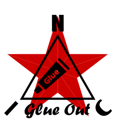

<p align="center">
  
</p>

# NIC-GLUE-OUT

*[English](README.md) · [Čeština](README_cs.md) · [Русский](README_ru.md)*

*Závazná je anglická verze.*

**Propojovací vrstva mezi knihovnami NIC — DMD, KSF, MLA, VDE — na straně čtení / exportu.**

---

[](https://opensource.org/licenses/MIT)

---

```
   NIC-MLA container ──▶ schema decode ──▶ rows ──▶ CSV / SQLite
```

> **Přečtěte si nejdřív.** Toto je sourozenec **NIC-GLUE-IN**, stejná myšlenka
> obrácená opačným směrem: GLUE-IN zapojuje datový řádek *do* kontejneru; GLUE-OUT
> prochází hotový kontejner a dostává ho *zpět ven* do tabulky. Stejně jako jeho sourozenec je to
> **propracovaný příklad plus malý katalog možností**, ne framework. Trvalou
> hodnotou je opět **[referenční přehled sladění knihoven](#referenční-přehled-sladění-knihoven)**
> — styčná místa, čtená z druhého konce. Příklad dělá tu nejjednodušší užitečnou
> věc: otevře kontejner, dekóduje každý záznam RAW podle jeho samopopisného
> schématu a celé to exportuje do **CSV nebo SQLite**. **Komprese NIC-DMD se
> tímto čtecím programem automaticky dekomprimuje**; mimo rozsah zůstává jen šifrování (NIC-KSF)
> — viz [níže](#nic-dmd-vestavěný-a-nic-ksf).
> **NIC-VDE** je interaktivní prohlížeč pro tytéž soubory; GLUE-OUT je
> cesta exportu bez uživatelského rozhraní.

---

## Referenční přehled sladění knihoven

Knihovny NIC jsou záměrně *hloupé a nezávislé*: MLA ukládá neprůhledné
bajty, VDE zobrazuje soubory, KSF transformuje bajty, DMD kóduje pakety. Žádná z nich
o ostatních neví. Glue je jakýkoli kód, který tato styčná místa sladí. GLUE-IN
je *zapisuje*; celým úkolem čtecího programu je *přečíst tatáž styčná místa zpět*. Ta,
která tento jednoduchý čtecí program používá:

| Styčné místo | Co nese kontejner | Co s tím čtecí program dělá |
|---|---|---|
| **Druh záznamu** | MLA nenese žádný typový bajt; záznam má jen bit `compressed` + `kf_back` (0 = klíčový snímek). Soubory jsou homogenní — neexistuje typ TEXT/EVENT/CLASS, význam vychází ze SCHEMA | z nich odvodí *druh* `raw` / `keyframe` / `delta` a pak dekóduje na pojmenované hodnoty: surové přímo podle schématu, komprimované přes DMD (viz níže); řádek je prázdný jen tehdy, když neodpovídá žádnému schématu |
| **Stanice** | log MLA ukládá 1bajtový *index* stanice; skutečná čísla jsou v tabulce stanic v prefixu | převede index → region/číslo, aby exportované řádky nesly skutečná čísla |
| **Čas** | log MLA má vyhrazenou 4bajtovou `timestamp`; pole schématu `log("datetime")` ji popisuje | čas se bere přímo z hlavičky logu — nikdy se nedoluje z datového bloku |
| **Rozložení polí** | schéma odděluje pole hlavičky `log(...)` od polí užitečných dat `data(...)` | `mla_decode_payload` rozdělí zabalený blok zpět na pojmenované, škálované hodnoty |
| **Integrita** | MLA pokrývá záznam logu (a volitelně datový blok) pomocí CRC16 | sloty se špatným CRC jádro MLA při připojení (mount) přeskočí — čtecí program vidí jen potvrzené záznamy |

Pokud soubor tuto tabulku respektuje při zápisu (což každá GLUE-IN dělá), přečte se
zde i v NIC-VDE přímo zpět, bez ohledu na to, jak byl strukturován zbytek.

---

## Co příklad nabízí

Záměrně malý čtecí program/exportér nad jediným kontejnerem MLA:

- **`GlueReader`** — otevře kontejner a pak ho iteruje nebo exportuje. Přečte
  samopopisné tabulky schématu/stanic z prefixu, dekóduje každá užitečná data
  měření RAW na pojmenované, škálované hodnoty, převede index stanice na
  její skutečný region/číslo a vše serializuje do **CSV** nebo **SQLite**.

```python
from nic_glue_out import GlueReader

with GlueReader("weather.mla") as r:
    for rec in r:                          # decoded records, oldest first (raw + compressed)
        if rec.values is not None:         # decoded values (raw or DMD-decompressed)
            print(rec.timestamp, rec.station_label,
                  {n: v for n, _u, v in rec.values})
        else:                              # no schema match — show the raw bytes
            print(rec.timestamp, rec.kind, rec.block.hex())

    r.write_csv("weather.csv")             # → idx,time,unix,sta_idx,region,number,kind,length,<fields…>
    r.write_sqlite("weather.db")           # → a one-table SQLite database
```

```bash
python3 examples/weather_export.py          # builds a sample, then exports weather.csv + weather.db
python3 tests/test_glue.py                  # or: pytest tests/
```

---

## Možnosti návrhu a návody

Toto jsou *možnosti*, ne požadavky — vyberte si, co se hodí. Příklad
implementuje nejjednodušší užitečné čtení + export; zbytek je krátký seznam nastavitelných voleb.

### 1. Cíle exportu — CSV nebo SQLite

Obojí vychází ze stejných sestavených řádků; modul `export` je hloupý
serializér (o MLA nic neví). `to_csv()` vrací bajty v UTF-8;
`to_sqlite()` vrací jednotabulkovou databázi jako bajty. Předejte `raw=True`, chcete-li zachovat
celá čísla tak, jak jsou přenášena, místo škálovaných fyzikálních hodnot podle schématu. Vlastní
cíl (Parquet, JSON Lines, socket) přidáte napsáním další funkce `to_…`, která
zpracuje tytéž sloupce `(name, sql_decl)` + n-tice řádků.

### 2. Odkud se bere časová značka

Čtecí program čas nikdy neodhaduje: záznam logu MLA má vyhrazenou 4bajtovou
`timestamp`, oddělenou od datového bloku, a pole schématu `log("datetime")`
ji pouze *popisuje*. Čtecí program ji tedy bere přímo z hlavičky logu
(`rec.timestamp`) — datový blok tvoří čistě užitečná data senzorů. Přesná inverze
styčného místa GLUE-IN „kam jde časová značka“: čas je v hlavičce, nikdy
zdvojený v datech, při zápisu *i* při čtení.

### 3. Filtrování

Čtecí program načte celý kontejner do RAM (zdokumentovaný model hostitele) a
filtruje na straně hostitele: `records(station=…, time_from=…, time_to=…)`. Na disku
není žádný index — jde o prosté sekvenční procházení se stejným výsledkem jako filtrování každého záznamu.

### 4. Soubory bez schématu

Kontejner zapsaný bez schématu lze přesto přečíst: každý záznam se nouzově zobrazí v
jediném sloupci `value` (text jako text, drobná užitečná data jako celé číslo, jinak hex).
Soubor *se* schématem místo toho dostane jeden pojmenovaný sloupec pro každé datové pole.

### NIC-DMD (vestavěný) a NIC-KSF

- **NIC-DMD (komprese).** Pokud zapisovač použil komprimovaný kanál GLUE-IN, nesou tyto
  záznamy bit `compressed` (druh `keyframe` / `delta`). Tento čtecí program
  **je automaticky dekomprimuje**: přehraje proud každé stanice přes
  `DmdDecoder(width)` pro danou stanici, v pořadí (`width` = celková datová
  šířka podle schématu), a výsledek pak provede stejným dekódováním podle schématu, jaké používá
  surová cesta — komprimované a surové řádky se tak exportují shodně. Záznam zobrazí prázdné
  buňky jen tehdy, pokud pro něj neexistuje vůbec žádné mapování ve schématu. Takové soubory
  umí procházet i **NIC-VDE**.
- **NIC-KSF (šifrování).** KSF patří do cesty *přenosu*, nikdy do úložiště:
  odesílatel šifruje před odesláním, příjemce dešifruje *dříve*, než se
  bajty uloží — kontejner tedy obsahuje otevřený text a tento čtecí program nepotřebuje žádný
  klíč. Přidejte ho na straně příjmu (`recv → ksf_decrypt → … → store`), jako zrcadlo
  odesílací strany GLUE-IN. Viz NIC-GLUE-IN.

---

## Struktura

```
nic_glue_out/       the glue example (GlueReader) + the dumb CSV/SQLite exporter
examples/           runnable, self-contained weather reader/exporter
tests/              read-back + decode + export tests
third_party/        vendored copy of NIC-MLA (see VENDORED.md)
tools/              sync_vendor.py — refresh third_party/ from canonical NIC-MLA/NIC-DMD
```

Čistý Python 3.10+, žádné externí balíčky — závislost je přibalená (vendored),
exportér používá `sqlite3` ze standardní knihovny.

---

## Datalogger (více profilů)

Export `.mla` z dataloggeru (několik profilů stanic v jednom souboru) do CSV / SQLite — jedna tabulka na profil: `is_datalogger()` + `dl_export_csv()` / `dl_export_sqlite()`. Viz `tests/test_datalogger.py`; úplná specifikace v NIC-MLA `DESIGN-MLA-datalogger.md`.

## Licence

Licence MIT — Copyright (c) 2026 NIC — Native Intellect Community

---

## Poděkování

Mému bratrovi za rady během vývoje tohoto projektu.
Za technickou pomoc s optimalizací kódu AI asistentům Claude (Anthropic) a Gemini (Google).
