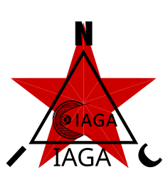

<p align="center">
  
</p>

# NIC-IAGA

*[English](README.md) · [Čeština](README_cs.md) · [Русский](README_ru.md)*

*Основной является английская версия.*

**Самостоятельная библиотека данных NIC — превращает лог магнитометра NIC-MLA в IAGA-2002.**

---

[](https://opensource.org/licenses/MIT)

---

```
   .mla  ──▶  [NIC-DMD decode if compressed]  ──▶  calibrated nT per component  ──▶  IAGA-2002
```

> **Что это такое.** Одна из самостоятельных библиотек данных NIC (наряду с NIC-MLA,
> NIC-DMD, NIC-MSEED). **IAGA-2002** — формат обмена наземной геомагнитологии:
> собственный формат INTERMAGNET и то, что **[SuperMAG](https://supermag.jhuapl.edu/)** принимает от
> своих ~600 вариометров по всему миру. NIC-Gauss — вариометр (он сообщает *отклонение*
> поля, а не абсолютные значения), поэтому его данные отправляются с объявлением `Data Type: variation` —
> именно тот класс, который принимает SuperMAG; абсолютная базовая линия остаётся задачей обсерваторий
> (доктрина вариометра). NIC-IAGA — это мост:
> она читает `.mla`, распаковывает блобы NIC-DMD, применяет калибровку из SCHEMA
> (`physical = (raw + offset) · 10^exp10` → **nT, а не отсчёты АЦП**) и записывает стандартный
> текст IAGA-2002, по одному файлу на станцию. **Готовая рабочая библиотека, а не фреймворк.**

> **Где находится калибровка — единственное намеренное отличие от NIC-MSEED.**
> miniSEED несёт «сырые» отсчёты АЦП и оставляет калибровку метаданным StationXML; IAGA-2002
> несёт **физические nT**, поэтому этот экспортёр применяет калибровку из SCHEMA на
> выходе. Оба читают один и тот же архив — сам архив остаётся «сырым» (derive-from-raw).

## Два слоя

- **`iaga`** — ядро, не зависящее от контейнера: строки из `(unix_s, x, y, z[, f])` чисел с плавающей точкой в nT →
  текст IAGA-2002 (12 обязательных 70-символьных записей заголовка, комментарии, заголовок столбцов,
  67-символьные строки данных; отсутствующее значение = `99999.00`, не наблюдавшееся = `88888.00`), плюс минимальный
  читатель для тестов туда-обратно (round-trip).
- **`from_mla`** — конвертер, который связывает **NIC-MLA + NIC-DMD** с этим ядром:
  воспроизведение DMD для каждой станции, автоопределение полей X/Y/Z(/F) (или по имени), калибровка, метаданные
  станции из таблицы STATION в MLA.

## Время

**Каждая строка несёт собственную метку** — IAGA-2002 — это текстовая таблица, а не привязанный к началу
ряд, поэтому, в отличие от NIC-MSEED, время считывается из каждой записи: `timestamp` — это
целая секунда, `subsec` определяет положение внутри этой секунды. `subsec_unit="index"` — значение
по умолчанию и то, что записывает станция NIC: `subsec` — это индекс кадра на
сетке со степенью двойки, а дробная часть равна `subsec / sample_rate_hz`, точно. Поток
обсерватории с метками на целых секундах оставляет `subsec` равным 0 и не требует
частоты; `"ms"` предназначен для лога с метками в миллисекундах, вызываемый объект (callable) — для всего
остального. **Формат записывает метку с точностью до миллисекунды** (`hh:mm:ss.sss`) — таков
IAGA-2002, и это предел данного экспорта, а не архива.

## Быстрый старт

```python
from nic_iaga import export_mla_to_iaga

export_mla_to_iaga(
    "gauss.mla", "gauss.iaga2002",
    stations={1: dict(iaga_code="NIC1", latitude=50.086, longitude=14.416,
                      elevation_m=235)},
    sampling="60 seconds", interval_type="1-minute")
```

## Тесты

```sh
python3 tests/test_iaga.py       # the pure writer: header shape, widths, round-trip
python3 tests/test_from_mla.py   # end-to-end: MLA (+DMD) → IAGA-2002 → parse-back
```

Встроенные (vendored) зависимости (`nic_mla`, `nic_dmd`) находятся в `third_party/`, точно так
же, как их встраивают NIC-MSEED, NIC-GLUE-IN и NIC-VDE.

## Лицензия

MIT — Copyright (c) 2026 NIC — Native Intellect Community
