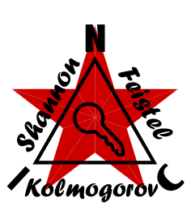

<p align="center">
  
</p>

---

# NIC-KSF — Kolmogorov Shannon Feistel

*[English](README.md) · [Čeština](README_cs.md) · [Русский](README_ru.md)*

*Závazná je anglická verze.*

## Šifrovací knihovna pro vestavěná zařízení

[](https://opensource.org/licenses/MIT)

---

## Co je KSF?

NIC-KSF **zamíchá data tak, aby je mohl přečíst jen ten, kdo drží klíč** — malý a rychlý druh
šifrování, který se ještě vejde i na drobný mikrokontrolér.

Uvnitř jde o odlehčenou symetrickou šifru postavenou na **SPECK-128** v **režimu CTR (Counter)**,
navrženou pro součástky s omezenými prostředky, jako je ATmega328, kde je RAM i Flash nedostatek a
výpočetní režie musí být minimální.

Knihovna má jedinou, jasně vymezenou odpovědnost: **zašifrovat nebo dešifrovat blok dat pomocí 128bitového klíče**. Veškerá správa klíčů, odvozování klíčů, práce s relacemi a logika protokolu jsou záměrně přenechány vyšším vrstvám.

---

## Vlastnosti

- Bloková šifra SPECK-128/128
- Režim CTR — šifrování a dešifrování jsou totožné operace (XOR s proudem klíče)
- Práce na místě (in-place) — není potřeba žádný další buffer
- Podporuje libovolnou délku užitečných dat od 1 do 255 bajtů
- Žádná dynamická alokace paměti (`malloc`)
- Žádné závislosti kromě `<stdint.h>` a `<string.h>`
- Kompatibilní s AVR (ATmega328) a standardními překladači C99
- Dvě varianty implementace — viz níže

---

## Varianty implementace

Obě varianty sdílejí stejné rozhraní (`nic_ksf.h`) a dávají totožné výsledky.

| Soubor | Popis |
|---|---|
| `nic_ksf_32.c` | Ruční 32bitová aritmetika — pro starší `avr-gcc` |
| `nic_ksf_64.c` | Nativní `uint64_t` — pro novější `avr-gcc` a PC |

Novější verze `avr-gcc` (Arduino IDE) dokážou přeložit nativní 64bitové operace na velmi efektivní posloupnost instrukcí `add` / `adc`. Doporučujeme vyzkoušet obě varianty a zvolit tu, která pro váš konkrétní projekt vytvoří menší nebo rychlejší kód.

---

## Bezpečnostní model

NIC-KSF je **čisté kryptografické primitivum**. Nespravuje klíče, relace ani čítače paketů.

**Volající je odpovědný za to, aby každé volání `ksf_encrypt` dostalo jedinečný 128bitový klíč.**

Kdyby byl tentýž klíč použit pro dva různé pakety, útočník by mohl zachycené šifrové texty vzájemně XORovat a proud klíče by se vyrušil. Zajištění jedinečnosti klíče je plně odpovědností volající vrstvy.

---

## API

```c
#include "nic_ksf.h"

/* Encrypts data in-place using a 128-bit key.
 * key  : 16 bytes (128 bits) — provided by the upper layer
 * data : pointer to buffer (overwritten with encrypted result)
 * len  : number of bytes (1–255)
 */
void ksf_encrypt(const uint8_t key[KSF_KEY_SIZE], uint8_t *data, uint8_t len);

/* Decrypts data in-place. Identical to ksf_encrypt in CTR mode. */
void ksf_decrypt(const uint8_t key[KSF_KEY_SIZE], uint8_t *data, uint8_t len);
```

---

## Příklad použití

```c
#include "nic_ksf.h"

/* 128-bit key prepared by the calling layer */
uint8_t key[16] = { /* ... 16 bytes ... */ };

/* Data to encrypt */
uint8_t payload[20] = { /* ... data ... */ };

/* Encrypt in-place */
ksf_encrypt(key, payload, sizeof(payload));

/* ... transmit ... */

/* Decrypt on the receiver side */
ksf_decrypt(key, payload, sizeof(payload));
```

---

## Sestavení

### PC / Linux

```bash
# 32-bit variant
gcc -std=c99 -Wall -Isrc -o test_ksf tests/test_ksf.c src/nic_ksf_32.c

# 64-bit variant
gcc -std=c99 -Wall -Isrc -o test_ksf tests/test_ksf.c src/nic_ksf_64.c

./test_ksf
```

Nebo jednoduše spusťte `make` (sestaví a spustí obě varianty).

### AVR / ATmega328

```bash
avr-gcc -std=c99 -mmcu=atmega328p -Os -Isrc -o nic_ksf.elf src/nic_ksf_32.c
```

---

## Struktura projektu

| Cesta | Popis |
|---|---|
| `src/nic_ksf.h` | Veřejné rozhraní a konstanty |
| `src/nic_ksf_32.c` | Implementace SPECK-128 CTR — 32bitová varianta |
| `src/nic_ksf_64.c` | Implementace SPECK-128 CTR — 64bitová varianta |
| `python/nic_ksf.py` | Referenční implementace v Pythonu (testování) |
| `python/ksf_demo.py` | Ukázkový skript od začátku do konce (end-to-end) |
| `tests/test_ksf.c` | Sada testů v C |
| `tests/test_ksf.py` | Sada testů v Pythonu |
| `Makefile` | Sestavení pro PC a AVR |
---

## Licence

Licence MIT — Copyright (c) 2026 NIC — Native Intellect Community

---

## Poděkování

Mému bratrovi za rady během vývoje tohoto projektu.
Za technickou pomoc s optimalizací kódu AI asistentům Claude (Anthropic) a Gemini (Google).
